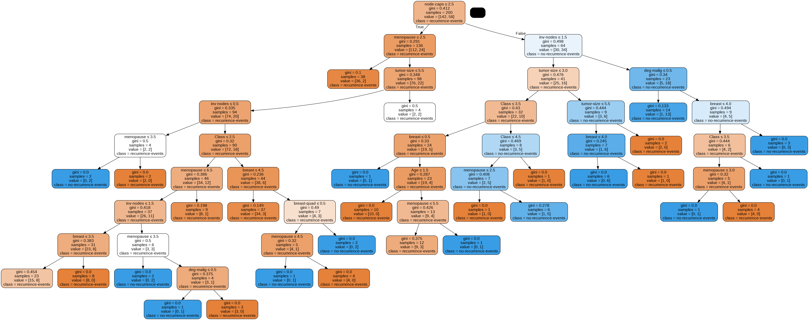

# Data Mining Assignment 1: Breast Cancer

**About the Dataset**
This is one of three domains provided by the Oncology Institute that has repeatedly appeared in the machine learning literature. (See also lymphography and primary-tumor.)

Source dataset: https://archive.ics.uci.edu/ml/datasets/Breast+Cancer

1. Class: no-recurrence-events, recurrence-events
2. age: 10-19, 20-29, 30-39, 40-49, 50-59, 60-69, 70-79, 80-89, 90-99.
3. menopause: lt40, ge40, premeno.
4. tumor-size: 0-4, 5-9, 10-14, 15-19, 20-24, 25-29, 30-34, 35-39, 40-44, 45-49, 50-54, 55-59.
5. inv-nodes: 0-2, 3-5, 6-8, 9-11, 12-14, 15-17, 18-20, 21-23, 24-26, 27-29, 30-32, 33-35, 36-39.
6. node-caps: yes, no.
7. deg-malig: 1, 2, 3.
8. breast: left, right.
9. breast-quad: left-up, left-low, right-up, right-low, central.
10. irradiat: yes, no.

# Data Visualization: Confusion Matrix and ROC (Receiver Operating Characteristic)

Note: 
- Positive: No Recurrence Events
- Negative: Recurrence Events

**Naive Bayes**

| _Confusion Matrix_ | **True Positive** | **False Negative** |
|:------------------:|:-----------------:|:------------------:|
| Predicted Positive |         52        |          7         |
| Predicted Negative |         16        |         11         |

Accuracy: 73.26% 

**Decision Tree**

| _Confusion Matrix_ | **True Positive** | **False Negative** |
|:------------------:|:-----------------:|:------------------:|
| Predicted Positive |         55        |          4         |
| Predicted Negative |         19        |          8         |

Accuracy: 73.26% 

<b>Decision Tree Diagram</b>

**Bayes**

| _Confusion Matrix_ | **True Positive** | **False Negative** |
|:------------------:|:-----------------:|:------------------:|
| Predicted Positive |         54        |          5         |
| Predicted Negative |         21        |          6         |

Accuracy: 69.77% 

**Overall ROC**

